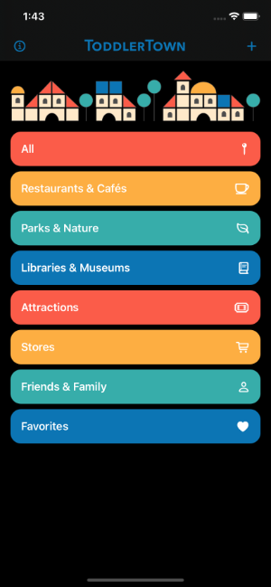
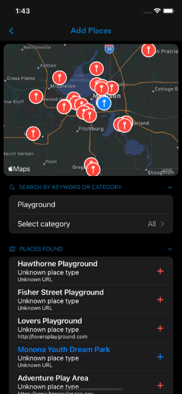
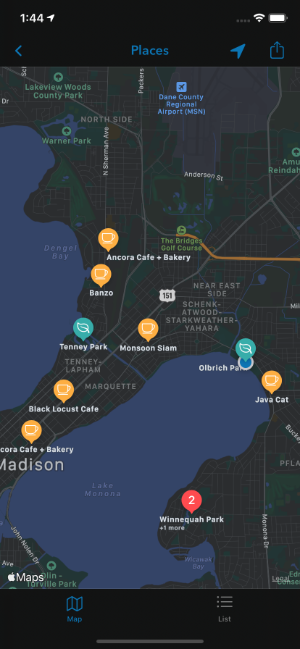
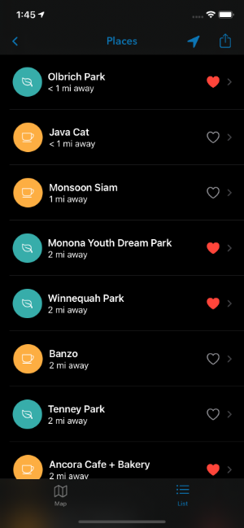
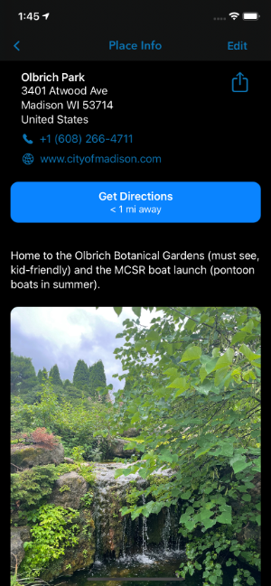
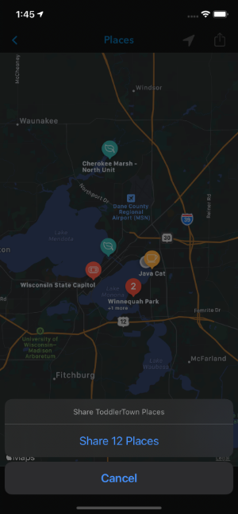

# ToddlerTown
## ToddlerTown app, v1.1, iOS 14.0+; out this Saturday on the App Store!
Written in Swift, using SwiftUI, UIKit, CoreData, and MapKit.

This app is for an intended audience of adults with young children, making convenient neighborhood guides with all of the toddler- and kid-centric places they enjoy! Features include adding places to maps through simple searches by region, adding notes and images to a place or marking favorites, filtering places by type (parks, attractions, cafes, etc.), and getting directions quickly through the Maps app.

### v1.1 features
 - Search View: Add new places, or filter existing places by type.
 - Add View: Add new places, searching by the map region.
 - Edit View (not shown): Edit place info, and add notes or photos.
 - Map View: View all or filtered places on a map.
 - List View: View all or filtered places in a list. Can favorite places.
 - Detail View: View the details for a place. Press "Directions" button for directions in Maps app.
 - Sharing: Share your places with friends and family!
 - Dark mode available!

1. After adding places to the map, select a category to filter Map and List views by type.

2. Add views by searching for nearby addresses or points-of-interest, then click "+" button to add to your town.

3. View your places in the Map view. User location shown is simulated.

4. View your places in the List view. You can "favorite" places here or delete places.

5. View details about a place, as well as a map of the location. You can click the "Go" button to open the location in Maps for quick and easy directions.

6. Share your places (or a filtered subset of them) as a JSON file with the extension .ttplaces.
7. 

Future versions plan to implement features from the following:
1. Curated guides, shared publicly, including possible monetization for advertising from local businesses (akin to neighborhood welcome mailers).
2. Implementing public APIs (Yelp or Wikimedia) or web scraping for public data.
