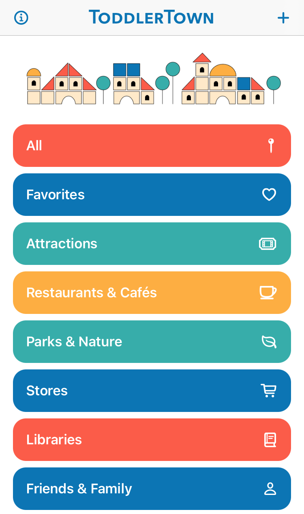
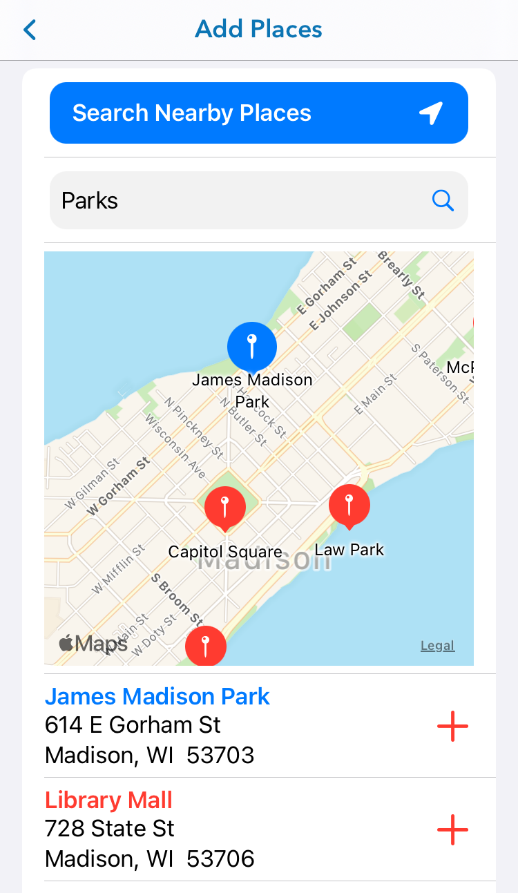
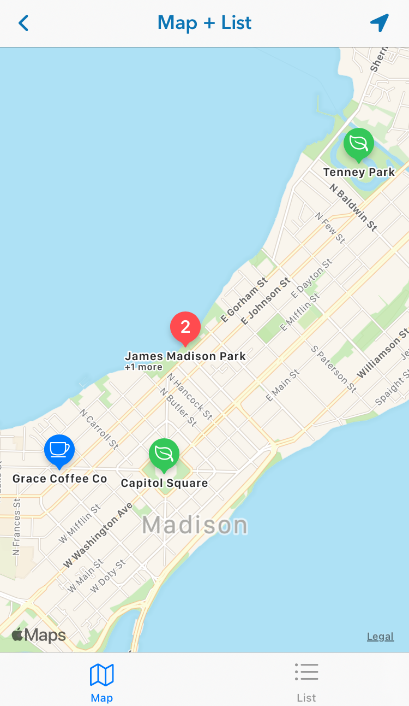
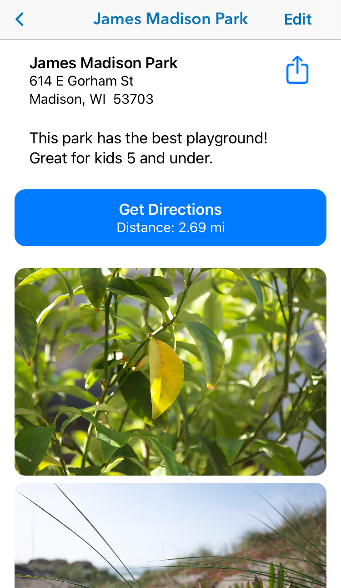

# ToddlerTown
## ToddlerTown app, v0.1 (beta), iOS 13.0+.
Written in Swift, using SwiftUI, UIKit, CoreData, and MapKit.

This app is for an intended audience of adults with young children, making convenient neighborhood guides with all of the toddler- and kid-centric places they enjoy! Features include adding places to maps through simple searches by region, adding notes and images to a place or marking favorites, filtering places by type (park, attraction, cafe, etc.), and getting directions quickly through the Maps app.

v0.1 MVP Release Notes
 - This is the first development release for this app.
 - Please look through the screens below for an overview of the features.
 - Search View: Add new places, or filter existing places by type.
 - Add View: Add new places, searching by the map region.
 - Edit View: Edit place info, and add notes or photos.
 - Map View: View all or filtered places on a map.
 - List View: View all or filtered places in a list. Can favorite places.
 - Detail View: View the details for a place. Press "Go" button for directions in Maps app.

1. After adding places to the map, select a category to filter Map and List views by type.

2. Add views by searching for nearby addresses or points-of-interest, then click "+" button to add to your town.

3. Edit the name, address, and place type. Add any relevant notes or photos.

4. View all of your places in the Map view, or filter places by type. User location shown is simulated.

5. View all of your places in the List view, or filter places by type. You can mark favorites here.

6. View details about a place, as well as a map of the location. You can click the "Go" button to open the location in Maps for quick and easy directions.

Future versions plan to implement features from the following:
1. Users sharing complete datasets for a neighborhood through ActivityViewController, CoreData (public container), or publicly-hosted JSON.
2. Curated guides, shared publicly, including possible monetization for advertising from local businesses (akin to neighborhood welcome mailers).
